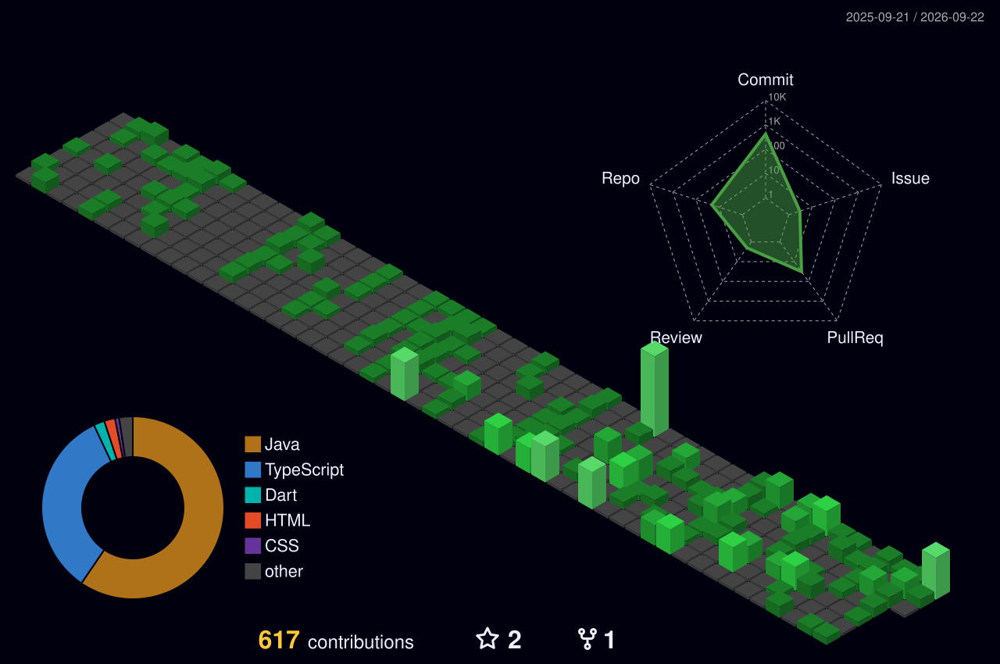

# Henrique Marangoni

**`Desenvolvedor Backend Java`** · **`Estudante de Ciência da Computação no IFSP`**

Olá! Me chamo Henrique e sou estudante de Ciência da Computação no IFSP. Trabalho com
**Java e Spring** no backend, arquitetura hexagonal e **React** no frontend.

Tenho dois estágios — um em sistema de gestão pública em produção, outro em sistemas
embarcados — e conduzo uma **iniciação científica** sobre métricas de aprendizado em
programação. Os projetos abaixo rodam de verdade: dois têm demo no ar.

---

### 🤖 Linguagens e Tecnologias

 
 

---

### 🚀 Projetos

| Projeto | O problema que ele resolve | Stack |
|---|---|---|
| **[CodeInsights](https://github.com/R1ck-dev/Code-Insights)** · [demo](https://code-insights-mu.vercel.app) | Um aluno evoluiu quanto em três meses — e o que a IA fez com a autonomia dele? Iniciação científica que mede isso por análise estática do código. | Java 21 · Spring Boot 4 · hexagonal · PostgreSQL · React 19 · TS |
| **[IFConecta](https://github.com/R1ck-dev/IFConecta)** | Comunicação acadêmica do IFSP dispersa em grupos de WhatsApp: clubes, turmas, posts e comunicados oficiais num lugar só. | Java 21 · Spring Boot 4 · hexagonal · PostgreSQL · Flyway · JWT · React |
| **[BloodCrown](https://github.com/R1ck-dev/BloodCrown-CharacterSheet)** · [demo](https://bloodcrown.netlify.app) | Ficha de RPG em papel com cálculo manual: virou mesa virtual com tabuleiro sincronizado ao vivo. | Java 21 · Spring Boot 4 · WebSocket/STOMP · MySQL · React 19 · Konva |
| **[Escola de Idiomas](https://github.com/R1ck-dev/Escola-Idiomas)** | Simulação de software house: levantamento com cliente, regras numeradas e ADRs antes da primeira linha de código. | Java 21 · Spring Boot 4 · hexagonal · PostgreSQL · React 19 |

**Também trabalho com:** Spring Security · JPA/Hibernate · Flyway · JWT · WebSocket/STOMP · JUnit 5 · Mockito · GitHub Actions · Vite

---

### 📊 Estatísticas

  

  

 

---

### 🧩 Contribuições

---

### 📫 Contato

[LinkedIn](https://www.linkedin.com/in/henrique-marangoni-484845239/) · henriquemarangoni.inacio1108@gmail.com
